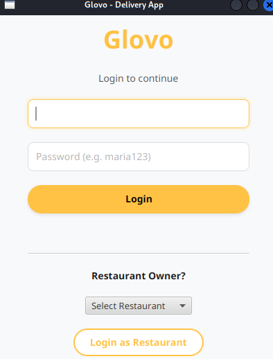
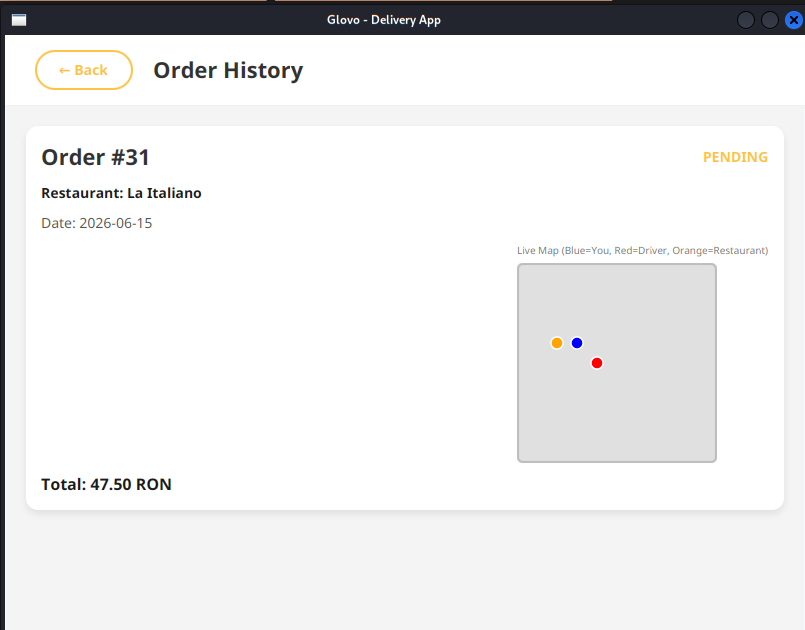
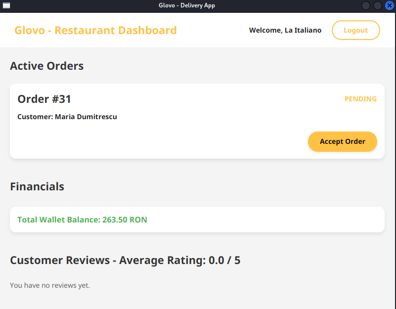
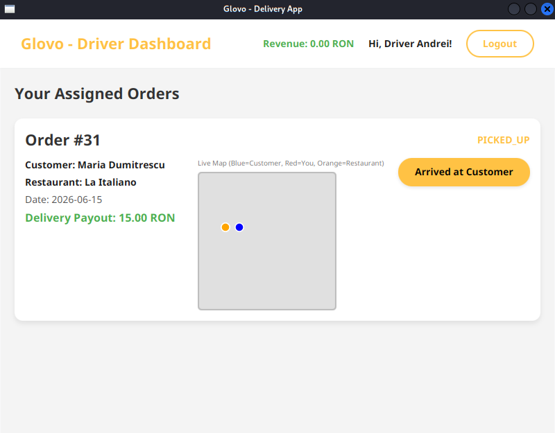
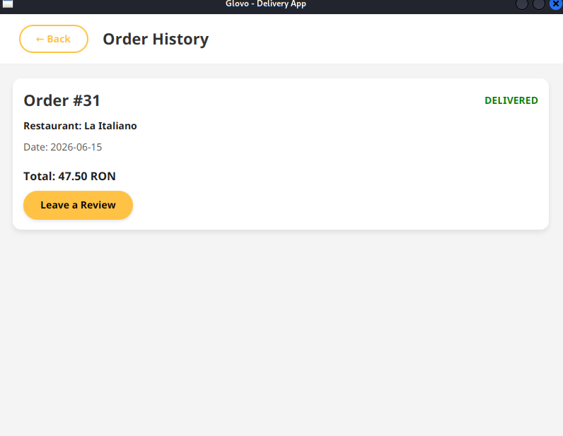
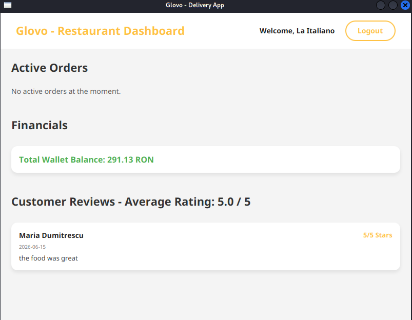

# Glovo Java Clone - Food Delivery Application


A comprehensive, desktop-based food delivery application inspired by Glovo. Built from scratch using **Java 17**, **JavaFX**, and **MariaDB**, this project demonstrates a robust, multi-layered architecture heavily utilizing Object-Oriented Programming (OOP) principles and classical Design Patterns.

## Key Features

### Role-Based Access & Dashboards
- **Customer Dashboard**: Browse restaurants, view detailed menus with customizable items, manage a shopping cart, place orders, and track order history.
- **Restaurant Dashboard**: Monitor incoming orders, view overall revenue, and read customer feedback/reviews.
- **Delivery Personnel Dashboard**: Track assigned deliveries, update order statuses (In Transit, Delivered), and view completed trips.

### Core Delivery & Business Logic
- **Dynamic Order Assignment**: Automatically matches placed orders with available delivery drivers based on system state.
- **Real-time Weather Simulation**: Uses the Observer pattern to simulate rainy weather conditions, which dynamically triggers different delivery fee strategies.
- **Digital Wallet Payment System**: Users can top up their digital wallets and seamlessly pay for their orders.
- **Review & Rating System**: Customers can leave a 1-5 star rating and comment on their experience after an order is completed.

### System & Architecture
- **Audit Logging**: All critical system actions are logged locally to an `audit.csv` file for tracking and debugging.
- **Database Persistence**: Fully integrated with MariaDB. Uses a robust Data Access Object (DAO) layer to persist entities like Users, Orders, Products, and Reviews.
- **Seeding Engine**: Automatically populates the database with initial test data if it's empty (`DatabaseSeeder`).

## Tech Stack

- **Core**: Java 17
- **GUI Framework**: JavaFX 17 (Controls & FXML)
- **Database**: MariaDB (JDBC Client 3.1.4)
- **Build Tool & Dependency Management**: Maven

## Architecture & Design Patterns

This project follows a clean architecture, decoupling the UI from business logic and data persistence:

1. **Facade Pattern**: The `App` class acts as the central entry point, abstracting the complexity of underlying services (`UserService`, `OrderService`, `PaymentService`, etc.).
2. **Singleton Pattern**: Used for centralized service management and `DatabaseService` to ensure a single, globally accessible database connection pool.
3. **Observer Pattern**: Implemented for real-time state changes. For example, `IWeatherObserver` listens for weather updates to adjust delivery logistics and fees dynamically.
4. **Strategy Pattern**: The `IDeliveryFeeStrategy` allows the system to swap out delivery fee calculations dynamically based on external conditions (e.g., standard weather vs. rainy weather).
5. **DAO Pattern**: Encapsulates all database operations (CRUD), completely separating SQL logic from the Java business models.

## Project Structure

```text
src/
├── database/    # Database connection manager and automated Seeder
├── enums/       # VehicleTypes, TransactionTypes, etc.
├── interfaces/  # Contracts for Observers, Strategies, DAOs
├── models/      # Core Domain Entities (User, Customer, Order, Product, etc.)
├── services/    # Business Logic Layer (Facade App, User/Order/Payment services)
├── sql/         # SQL schema definitions for MariaDB
├── ui/          # JavaFX Views and Controllers (Dashboards, Login, Cart)
└── pom.xml      # Maven configuration and dependency management
```

## Setup and Installation

### Prerequisites
- **Java Development Kit (JDK) 17** or higher.
- **Apache Maven**.
- **MariaDB Server** running locally or remotely.

### Database Configuration
1. Ensure your MariaDB server is running.
2. Create a database schema (e.g., `glovo_db`).
3. Update the database connection credentials in the `database.DatabaseService` or appropriate configuration file.
4. *Note:* The application includes a `DatabaseSeeder` that will automatically create necessary tables and seed mock data upon the first run!

### Running the Application
1. Clone the repository and navigate to the project root.
2. Build the project and download dependencies using Maven:
   ```bash
   mvn clean install
   ```
3. Run the JavaFX application:
   ```bash
   mvn javafx:run
   ```
## Screenshots 
###Landing Page 


1. Customer Order History :
   
2. Restaurant Dashboard :
   
3. Delivery Man Dashboard :
   
4. Customer Reviews :
   
5. Restaurant Feedback :
   
